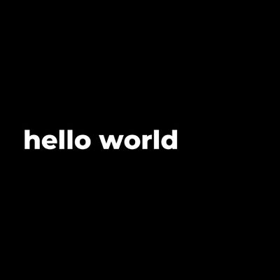

Generating white on black pictures, and more.  

### Install  
```  
git clone https://github.com/MichelML/wob.git \ 
cd wob \ 
sudo npm i -g .  
```  

### Usage  
```  
wob -m "Hello World" -r 400  
```  
This will output:   
    
  
It adapts to multiple lines text:   
```   
wob -m "This is a little bit awesome." -r 400  
```  
This will output:    
    


### Help
Run the following to see all options:  
```  
wob --help   
```  
This should output something similar to:  
```
Options:
  --resize, -r      Resize picture to nxn pixels                        [number]
  --bgColor, -b     CSS/Hex value of the background  [string] [default: "black"]
  --color, -c       CSS/Hex value of the font        [string] [default: "white"]
  --message, -m     Message                               [string] [default: ""]
  --fontsize, -s    Font size in pixels                  [number] [default: 200]
  --fontfamily, -f  Font-family
       [string] [choices: "anton", "comfortaa", "karla", "roboto", "montserrat"]
                                                         [default: "montserrat"]
  -v, --version     Show version number                                [boolean]
  -h, --help        Show help                                          [boolean]
```  

